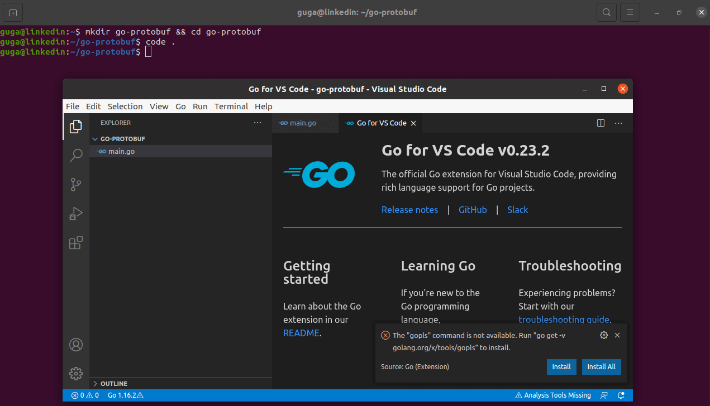

# Protocol Buffers 3 with Go


### **Wikipedia**

Protocol Buffers (Protobuf) is a method of serializing structured data. It is useful in developing programs to communicate with each other over a network or for storing data. The method involves an interface description language that describes the structure of some data and a program that generates source code from that description for generating or parsing a stream of bytes that represents the structured data.

Google developed Protocol Buffers for internal use and provided a code generator for multiple languages under an open source license.

Protocol Buffers are widely used at Google for storing and interchanging all kinds of structured information. The method serves as a basis for a custom remote procedure call (RPC) system that is used for nearly all inter-machine communication at Google.

Protocol Buffers are similar to the Apache Thrift (used by Facebook), Ion (created by Amazon), or Microsoft Bond protocols, offering as well a concrete RPC protocol stack to use for defined services called gRPC.

https://pt.wikipedia.org/wiki/Protocol_Buffers

### **Google**

Protocol buffers are Google's language-neutral, platform-neutral, extensible mechanism for serializing structured data – think XML, but smaller, faster, and simpler. You define how you want your data to be structured once, then you can use special generated source code to easily write and read your structured data to and from a variety of data streams and using a variety of languages.

https://developers.google.com/protocol-buffers

https://developers.google.com/protocol-buffers/docs/proto3

### **Why Use Protocol Buffers**

- **Smaller**: It is 3-10 times smaller than XML or JSON. If you are storing data then it will reduce storage space. If you are using it as RPC then it will reduce latency as message size will be much smaller.

- **Faster**: Serialization and deserializations is 20-100 times faster which will increase performance of your system as it is using less time in serialization and deserializations (source).

- **Simpler and extensible**: It is simple to implement and start with. It is very easy to update or extend an existing protobuf message file.

- **Language and platform-neutral**: Protobuf messages are language and platform independent. That gives you freedom to choose technology of your choice for different entity using this protocol. For example your client can be using C# but it can still communicate with your server written in Java through protobuf.

---

## **Protobuf 3 with GO**

In a Ubuntu fresh install you will need to install GO first (https://golang.org/doc/install):


And the Protoc Compiler:

_OBS: Go to https://github.com/protocolbuffers/protobuf/releases to see the current version._

_If you don't have CURL installed - `sudo apt-get install curl`_

```
guga@linkedin:~$ curl -OL https://github.com/protocolbuffers/protobuf/releases/download/v3.15.6/protoc-3.15.6-linux-x86_64.zip

guga@linkedin:~$ unzip protoc-3.15.6-linux-x86_64.zip -d protoc3

guga@linkedin:~$ sudo mv protoc3/bin/* /usr/local/bin/

guga@linkedin:~$ sudo mv protoc3/include/* /usr/local/include/

guga@linkedin:~$ sudo chown $USER /usr/local/bin/protoc

guga@linkedin:~$ sudo chown -R $USER /usr/local/include/google

```


To code we can use Visual Studio Code, from Microsoft:

Download from https://code.visualstudio.com/Download and install `sudo apt-get install ./code_1.54.3-1615806378_amd64.deb`

You can also add some extensions: _Go_, _vscode-proto3_ and _Clang-Format_.

(To format a .proto document in VSCode I also need to install `sudo apt install clang-format`)


## Start Coding

First, we need to create the folder for your project, from your home folder `mkdir go-protobuf && cd go-protobuf`, and now this will be the root of your project. Inside the folder open VSCode `code .` and create the first file `main.go`.

VSCode may ask you to install some missing dependencies, like:

```
The "gopls" command is not available.
Run "go get -v golang.org/x/tools/gopls" to install.
```

Just click install and wait for `All tools successfully installed. You are ready to Go :).`



Inside `main.go` put the code and save.

```Go
package main

import "fmt"

func main() {
    fmt.Println("Hello World")
}
```

In the botton right of VSCode you may see:

Just click Analysis Tools Missing, click install and wait until you see `All tools successfully installed. You are ready to Go :)` again.


Now in terminal you can run `go run main.go` to see if Go is working.


## Phone Book Project

In this project you will create a simple phone book, to store some people data and theirs phone numbers. Since we are not running inside GO's default project folder, let's just start a go module:

```
go mod init go-protobuf
```

We already know that we will create a phone book, so now we can define what information we will store. First we want a Person, with _name_ and _email_, and each person can have one or more phones with _number_ and _type_. And for the type we need just _mobile_, _home_ or _work_. And a good thing to have is the date that the information was last updated.

Now that we know what is need, let's create the `.proto` file `src/phonebook/phonebook.proto`.

```Protobuf
syntax = "proto3";

package phonebookpb;

option go_package = "src/phonebook/phonebookpb";

message Person {
  string id = 1;
  string name = 2;
  string email = 3;
  repeated string phones = 4;
}

message PhoneBook { repeated Person people = 1; }
```

In this file we are telling that the Protocol Buffer version is _3_, the package will be _phonebookpb_, we are adding the option to define that the GO package will be inside _src/phonebook/phonebookpb_.

Then we created two messages, one for Person (that can have multiple phones), and other for the Phone Book, that can have multiple Persons.

But it's not right, the phones field is a `repeated string`, and we defined before that phones can have _number_ and _type_. So we need to change:

```Protobuf
message Person {
  string id = 1;
  string name = 2;
  string email = 3;

  message PhoneNumber {
    string number = 1;
    string type = 2;
  }

  repeated PhoneNumber phones = 4;
}
```

Now we have a nested message `PhoneNumber` that have number and phone type, and now _phones_ are of the type _PhoneNumber_. Well... Phone Type is a string, so can be any type, and we want just _mobile_, _home_ or _work_. Let's change again:

```Protobuf
message Person {
  string id = 1;
  string name = 2;
  string email = 3;

  enum PhoneType {
    MOBILE = 0;
    HOME = 1;
    WORK = 2;
  }

  message PhoneNumber {
    string number = 1;
    PhoneType type = 2;
  }

  repeated PhoneNumber phones = 4;
}
```

Ok, now we have _PhoneType_ as a enum (Enumerated Type - https://en.wikipedia.org/wiki/Enumerated_type). In Protocol Buffers the first value will be the default one, in this case `MOBILE`.

The last thing we need is a field to see the date that the information was last updated. For this we will use Protocol Buffers Well-Known Types
(https://developers.google.com/protocol-buffers/docs/reference/google.protobuf#timestamp).

Now `src/phonebook/phonebook.proto` will be like this:

```Protobuf
syntax = "proto3";

package phonebookpb;

option go_package = "src/phonebook/phonebookpb";

import "google/protobuf/timestamp.proto";

message Person {
  string id = 1;
  string name = 2;
  string email = 3;

  enum PhoneType {
    MOBILE = 0;
    HOME = 1;
    WORK = 2;
  }

  message PhoneNumber {
    string number = 1;
    PhoneType type = 2;
  }

  repeated PhoneNumber phones = 4;
  google.protobuf.Timestamp last_updated = 5;
}

message PhoneBook { repeated Person people = 1; }
```

With the `.proto` file defined the next step is generate the code. First we need to install the Go packages:

```
guga@linkedin:~$ go get -u github.com/golang/protobuf/{proto,protoc-gen-go}

guga@linkedin:~$ echo 'export GOPATH=$HOME/Go' >> $HOME/.bashrc

guga@linkedin:~$ echo 'export PATH=$PATH:$GOPATH/bin' >> $HOME/.bashrc

guga@linkedin:~$ source $HOME/.bashrc
```


The compiler `protoc` need the _source directory_ `-I .` the _destination directory_ `--go_out=.` and the relative path to the proto file `src/phonebook/phonebook.proto`.

So run:

```
protoc -I . --go_out=. src/phonebook/phonebook.proto
```

To generate the GO code. For this project the code will be in `src/phonebook/phonebookpb/phonebook.pb.go`

> _OBS: If you see this message in terminal:_

```
protoc-gen-go: program not found or is not executable
Please specify a program using absolute path or make sure the program is available in your PATH system variable
--go_out: protoc-gen-go: Plugin failed with status code 1.
```

> _Run `go get -u github.com/golang/protobuf/{proto,protoc-gen-go}` again._

At this point is good run `go get all` to update the packages.

For now on we will contine the code inside `main.go` file, so we can remove `fmt.Println("Hello World")` and start coding inside the main function (GO entry point) `func main() {`

VSCode may ask again to install some tools to help you during the code, so just do it.

First we will do a function to create person, and for the ID we can use UUID to generate `go get github.com/google/uuid` and to generate the Last Updated, we will use the Protocol Buffers Well-Known Types.

```Go
func createPerson(name string, email string) *phonebookpb.Person {
	pe := &phonebookpb.Person{
		Id:          uuid.New().String(),
		Name:        name,
		Email:       email,
		Phones:      []*phonebookpb.Person_PhoneNumber{},
		LastUpdated: timestamppb.Now(),
	}
	return pe
}
```

This function will create a person with name and email, autogenerate a ID and the updated time, and a empty phone slice.

Now we will create a function to Phone Numbers:

```Go
func createPhone(n string, t phonebookpb.Person_PhoneType) *phonebookpb.Person_PhoneNumber {
	ph := &phonebookpb.Person_PhoneNumber{
		Number: n,
		Type:   t,
	}
	return ph
}
```

Phone will use the enum, in this case we can have `Person_MOBILE`, `Person_HOME` or `Person_WORK`.

and inside `main()`

```Go
person1 := createPerson("Guga Zimmermann", "gugazimmermann@gmail.com")
person1Phone1 := createPhone("+55 47 98870-4247", phonebookpb.Person_MOBILE)
person1Phone2 := createPhone("+55 47 98870-4247", phonebookpb.Person_WORK)
```

We have now a Person and two phones, we need to add theses phones to the person.

```Go
func addPhonesToPerson(person *phonebookpb.Person, phones ...*phonebookpb.Person_PhoneNumber) {
	phoneNumber := []*phonebookpb.Person_PhoneNumber{}
	for _, phone := range phones {
		phoneNumber = append(phoneNumber, phone)
	}
	person.Phones = phoneNumber
}
```

`main()`:

```Go
addPhonesToPerson(person1, person1Phone1, person1Phone2)
```

Let's create a second Person and add a phone.

```Go
person2 := createPerson("Second Person", "secondperson@email.com")
person2Phone1 := createPhone("+XX XX XXXXX-XXXX", phonebookpb.Person_HOME)
addPhonesToPerson(person2, person2Phone1)
```

We have now two persons with phones but no Phone Book, we can solve it.

```Go
func addPersonToPhoneBook(phoneBook *phonebookpb.PhoneBook, persons ...*phonebookpb.Person) {
	people := []*phonebookpb.Person{}
	for _, person := range persons {
		people = append(people, person)
	}
	phoneBook.People = people
}
```

`main()`:

```Go
phoneBook := &phonebookpb.PhoneBook{}
addPersonToPhoneBook(phoneBook, person1, person2)
```

Until now we can create person, create phone, add the phone to a person, create the phone book and add people to the phone book.

```Go
package main

import (
	"go-protobuf/src/phonebook/phonebookpb"

	"github.com/google/uuid"
	"google.golang.org/protobuf/types/known/timestamppb"
)

func main() {
	person1 := createPerson("Guga Zimmermann", "gugazimmermann@gmail.com")
	person1Phone1 := createPhone("+55 47 98870-4247", phonebookpb.Person_MOBILE)
	person1Phone2 := createPhone("+55 47 98870-4247", phonebookpb.Person_WORK)
	addPhonesToPerson(person1, person1Phone1, person1Phone2)

	person2 := createPerson("Second Person", "secondperson@email.com")
	person2Phone1 := createPhone("+XX XX XXXXX-XXXX", phonebookpb.Person_HOME)
	addPhonesToPerson(person2, person2Phone1)

	phoneBook := &phonebookpb.PhoneBook{}
	addPersonToPhoneBook(phoneBook, person1, person2)
}

func createPerson(name string, email string) *phonebookpb.Person {
	pe := &phonebookpb.Person{
		Id:          uuid.New().String(),
		Name:        name,
		Email:       email,
		Phones:      []*phonebookpb.Person_PhoneNumber{},
		LastUpdated: timestamppb.Now(),
	}
	return pe
}

func createPhone(n string, t phonebookpb.Person_PhoneType) *phonebookpb.Person_PhoneNumber {
	ph := &phonebookpb.Person_PhoneNumber{
		Number: n,
		Type:   t,
	}
	return ph
}

func addPhonesToPerson(person *phonebookpb.Person, phones ...*phonebookpb.Person_PhoneNumber) {
	phoneNumber := []*phonebookpb.Person_PhoneNumber{}
	for _, phone := range phones {
		phoneNumber = append(phoneNumber, phone)
	}
	person.Phones = phoneNumber
}

func addPersonToPhoneBook(phoneBook *phonebookpb.PhoneBook, persons ...*phonebookpb.Person) {
	people := []*phonebookpb.Person{}
	for _, person := range persons {
		people = append(people, person)
	}
	phoneBook.People = people
}
```

Now we will use a Protocol Buffer tool called `protojson` to transform your Phone Book TO JSON:

```Go
func protobufToJson(pb proto.Message) string {
	marshaler := protojson.MarshalOptions{
		Indent:          "  ",
		UseProtoNames:   true,
		EmitUnpopulated: true,
	}
	j, err := marshaler.Marshal(pb)
	if err != nil {
		log.Fatalln("Can't convert Protobuf to JSON", err)
	}
	// the return type of Marshal is []byte, so we'll convert to string
	return string(j)
}
```

`main()`:

```Go
jsonPhoneBook := protobufToJson(phoneBook)
fmt.Println(jsonPhoneBook)
```

Running `go run main.go` we will see:

```JSON
{
  "people":  [
    {
      "id":  "14ee783d-c0aa-4fd0-9b6f-a10cda73eea9",
      "name":  "Guga Zimmermann",
      "email":  "gugazimmermann@gmail.com",
      "phones":  [
        {
          "number":  "+55 47 98870-4247",
          "type":  "MOBILE"
        },
        {
          "number":  "+55 47 98870-4247",
          "type":  "WORK"
        }
      ],
      "last_updated":  "2021-03-19T19:13:19.691017580Z"
    },
    {
      "id":  "b42b6cc2-58b6-4c84-b840-546ec9840fc7",
      "name":  "Second Person",
      "email":  "secondperson@email.com",
      "phones":  [
        {
          "number":  "+XX XX XXXXX-XXXX",
          "type":  "HOME"
        }
      ],
      "last_updated":  "2021-03-19T19:13:19.691027115Z"
    }
  ]
}
```


To change the JSON back to Protocol Buffer, we need first convert the JSON string to []byte, and then to Protobuf.

```Go
func jsonToProtobuf(json string, pb proto.Message) {
	// Unmarshal accept []byte, so we'll convert json from string to []byte
	err := protojson.Unmarshal([]byte(json), pb)
	if err != nil {
		log.Fatalln("Can't convert from JSON to Protobuf", err)
	}
}
```

`main()`:

```Go
emptyPhoneBookProtobuf := &phonebookpb.PhoneBook{}
jsonToProtobuf(jsonPhoneBook, emptyPhoneBookProtobuf)
fmt.Println(emptyPhoneBookProtobuf)
```

As we can see, we need to create a empty phone book protobuf.

Running `go run main.go` we will see:

```Bash
people:{id:"36dccce8-e31f-4b20-a50d-fc887475d21d" name:"Guga Zimmermann" email:"gugazimmermann@gmail.com" phones:{number:"+55 47 98870-4247"} phones:{number:"+55 47 98870-4247" type:WORK} last_updated:{seconds:1616181664 nanos:739051179}} people:{id:"d8ceeb9b-f6c1-4a5c-92b2-908632ca98f4" name:"Second Person" email:"secondperson@email.com" phones:{number:"+XX XX XXXXX-XXXX" type:HOME} last_updated:{seconds:1616181664 nanos:739056844}}
```


But the cool of Protobuf is that we can store the data in a file smaller than if we just save the JSON, let's see how to do it:

```Go
func writeProtobufToFile(fileName string, pb proto.Message) error {
	out, err := proto.Marshal(pb)
	if err != nil {
		log.Fatalln("Can't serialize to bytes", err)
		return err

	}
	if err := ioutil.WriteFile(fileName, out, 0664); err != nil {
		log.Fatalln("Can't write to file", err)
		return err
	}
	return nil
}
```

`main()`:

```Go
writeProtobufToFile("phonebook.bin", phoneBook)
```

after running `go run main.go` you can see that the file is almost 3 times smaller than the json file.


But if you try to open the file, you will not be able to see the content in a human readable way:


```Go
func readProtobufFromFile(fileName string, pb proto.Message) error {
	in, err := ioutil.ReadFile(fileName)
	if err != nil {
		log.Fatalln("Can't read the file", err)
		return err
	}
	if err := proto.Unmarshal(in, pb); err != nil {
		log.Fatalln("Can't unserialize the bytes", err)
		return err
	}
	return nil
}
```

`main()`:

```Go
emptyPhoneBookProtobuf2 := &phonebookpb.PhoneBook{}
readProtobufFromFile("phonebook.bin", emptyPhoneBookProtobuf2)
```

Again, we will need a empty phone book protobuf to receive the information.


Now you `main.go` will be like this:

```Go
package main

import (
	"fmt"
	"go-protobuf/src/phonebook/phonebookpb"
	"io/ioutil"
	"log"

	"github.com/google/uuid"
	"google.golang.org/protobuf/encoding/protojson"
	"google.golang.org/protobuf/proto"
	"google.golang.org/protobuf/types/known/timestamppb"
)

func main() {
	person1 := createPerson("Guga Zimmermann", "gugazimmermann@gmail.com")
	person1Phone1 := createPhone("+55 47 98870-4247", phonebookpb.Person_MOBILE)
	person1Phone2 := createPhone("+55 47 98870-4247", phonebookpb.Person_WORK)
	addPhonesToPerson(person1, person1Phone1, person1Phone2)

	person2 := createPerson("Second Person", "secondperson@email.com")
	person2Phone1 := createPhone("+XX XX XXXXX-XXXX", phonebookpb.Person_HOME)
	addPhonesToPerson(person2, person2Phone1)

	phoneBook := &phonebookpb.PhoneBook{}
	addPersonToPhoneBook(phoneBook, person1, person2)

	jsonPhoneBook := protobufToJson(phoneBook)

	emptyPhoneBookProtobuf := &phonebookpb.PhoneBook{}
	jsonToProtobuf(jsonPhoneBook, emptyPhoneBookProtobuf)

	writeProtobufToFile("phonebook.bin", phoneBook)

	emptyPhoneBookProtobuf2 := &phonebookpb.PhoneBook{}
	readProtobufFromFile("phonebook.bin", emptyPhoneBookProtobuf2)
	fmt.Println(emptyPhoneBookProtobuf2)
}

func createPerson(name string, email string) *phonebookpb.Person {
	pe := &phonebookpb.Person{
		Id:          uuid.New().String(),
		Name:        name,
		Email:       email,
		Phones:      []*phonebookpb.Person_PhoneNumber{},
		LastUpdated: timestamppb.Now(),
	}
	return pe
}

func createPhone(n string, t phonebookpb.Person_PhoneType) *phonebookpb.Person_PhoneNumber {
	ph := &phonebookpb.Person_PhoneNumber{
		Number: n,
		Type:   t,
	}
	return ph
}

func addPhonesToPerson(person *phonebookpb.Person, phones ...*phonebookpb.Person_PhoneNumber) {
	phoneNumber := []*phonebookpb.Person_PhoneNumber{}
	for _, phone := range phones {
		phoneNumber = append(phoneNumber, phone)
	}
	person.Phones = phoneNumber
}

func addPersonToPhoneBook(phoneBook *phonebookpb.PhoneBook, persons ...*phonebookpb.Person) {
	people := []*phonebookpb.Person{}
	for _, person := range persons {
		people = append(people, person)
	}
	phoneBook.People = people
}

func protobufToJson(pb proto.Message) string {
	marshaler := protojson.MarshalOptions{
		Indent:          "  ",
		UseProtoNames:   true,
		EmitUnpopulated: true,
	}
	j, err := marshaler.Marshal(pb)
	if err != nil {
		log.Fatalln("Can't convert Protobuf to JSON", err)
	}
	// the return type of Marshal is []byte, so we'll convert to string
	return string(j)
}

func jsonToProtobuf(json string, pb proto.Message) {
	// Unmarshal accept []byte, so we'll convert json from string to []byte
	err := protojson.Unmarshal([]byte(json), pb)
	if err != nil {
		log.Fatalln("Can't convert from JSON to Protobuf", err)
	}
}

func writeProtobufToFile(fileName string, pb proto.Message) error {
	out, err := proto.Marshal(pb)
	if err != nil {
		log.Fatalln("Can't serialize to bytes", err)
		return err

	}
	if err := ioutil.WriteFile(fileName, out, 0664); err != nil {
		log.Fatalln("Can't write to file", err)
		return err
	}
	return nil
}

func readProtobufFromFile(fileName string, pb proto.Message) error {
	in, err := ioutil.ReadFile(fileName)
	if err != nil {
		log.Fatalln("Can't read the file", err)
		return err
	}
	if err := proto.Unmarshal(in, pb); err != nil {
		log.Fatalln("Can't unserialize the bytes", err)
		return err
	}
	return nil
}

```

### Evolving the Data

If we need to evolve your data we can just update the `.proto` file, and we will keep the code compatible without break.

But remember, every time you change the `.proto` file you need to generate the code again.

#### Adding new Fields

We can add a new field, like address, to your message, but we need to remember to follow the tag number.

```Protobuf
message Person {
  string id = 1;
  string name = 2;
  string email = 3;

  enum PhoneType {
    MOBILE = 0;
    HOME = 1;
    WORK = 2;
  }

  message PhoneNumber {
    string number = 1;
    PhoneType type = 2;
  }

  repeated PhoneNumber phones = 4;
  google.protobuf.Timestamp last_updated = 5;
  string address = 6;
}
```

If you run the main.go without change anything, the code will not break. But you can also update the code and add the address to the create person function, and start using the new field.

#### Removing Fields

Let's say that now we don't need the email anymore, so we need to update the `.proto` file and remove the email field. We can do it tellling Protobuf that the field and the tag are _reserved_ to avoid conflicts.

```Protobuf
message Person {
  reserved 3;
  reserved "email";
  string id = 1;
  string name = 2;

  enum PhoneType {
    MOBILE = 0;
    HOME = 1;
    WORK = 2;
  }

  message PhoneNumber {
    string number = 1;
    PhoneType type = 2;
  }

  repeated PhoneNumber phones = 4;
  google.protobuf.Timestamp last_updated = 5;
  string address = 6;
}
```

Running main.go without change the code, we will see:

```bash
# command-line-arguments
./main.go:44:3: unknown field 'Email' in struct literal of type phonebookpb.Person
```

And this happen because we are not dealing right in this quick sample with the Protobuf struct. We can just comment the Email line.

```Go
func createPerson(name string, email string, address string) *phonebookpb.Person {
	pe := &phonebookpb.Person{
		Id:   uuid.New().String(),
		Name: name,
		// Email:       email,
		Phones:      []*phonebookpb.Person_PhoneNumber{},
		LastUpdated: timestamppb.Now(),
		Address:     address,
	}
	return pe
}
```

---

### Final files

`src/phonebook/phonebook.proto`

```Protobuf
syntax = "proto3";

package phonebookpb;

option go_package = "src/phonebook/phonebookpb";

import "google/protobuf/timestamp.proto";

message Person {
  reserved 3;
  reserved "email";
  string id = 1;
  string name = 2;

  enum PhoneType {
    MOBILE = 0;
    HOME = 1;
    WORK = 2;
  }

  message PhoneNumber {
    string number = 1;
    PhoneType type = 2;
  }

  repeated PhoneNumber phones = 4;
  google.protobuf.Timestamp last_updated = 5;
  string address = 6;
}

message PhoneBook { repeated Person people = 1; }
```

`main.go`

```Go
package main

import (
	"fmt"
	"go-protobuf/src/phonebook/phonebookpb"
	"io/ioutil"
	"log"

	"github.com/google/uuid"
	"google.golang.org/protobuf/encoding/protojson"
	"google.golang.org/protobuf/proto"
	"google.golang.org/protobuf/types/known/timestamppb"
)

func main() {
	person1 := createPerson("Guga Zimmermann", "gugazimmermann@gmail.com", "Itajaí / Santa Catarina / Brazil")
	person1Phone1 := createPhone("+55 47 98870-4247", phonebookpb.Person_MOBILE)
	person1Phone2 := createPhone("+55 47 98870-4247", phonebookpb.Person_WORK)
	addPhonesToPerson(person1, person1Phone1, person1Phone2)

	person2 := createPerson("Second Person", "secondperson@email.com", "Brazil")
	person2Phone1 := createPhone("+XX XX XXXXX-XXXX", phonebookpb.Person_HOME)
	addPhonesToPerson(person2, person2Phone1)

	phoneBook := &phonebookpb.PhoneBook{}
	addPersonToPhoneBook(phoneBook, person1, person2)

	jsonPhoneBook := protobufToJson(phoneBook)

	emptyPhoneBookProtobuf := &phonebookpb.PhoneBook{}
	jsonToProtobuf(jsonPhoneBook, emptyPhoneBookProtobuf)

	writeProtobufToFile("phonebook.bin", phoneBook)

	emptyPhoneBookProtobuf2 := &phonebookpb.PhoneBook{}
	readProtobufFromFile("phonebook.bin", emptyPhoneBookProtobuf2)
	fmt.Println(emptyPhoneBookProtobuf2)
}

func createPerson(name string, email string, address string) *phonebookpb.Person {
	pe := &phonebookpb.Person{
		Id:   uuid.New().String(),
		Name: name,
		// Email:       email,
		Phones:      []*phonebookpb.Person_PhoneNumber{},
		LastUpdated: timestamppb.Now(),
		Address:     address,
	}
	return pe
}

func createPhone(n string, t phonebookpb.Person_PhoneType) *phonebookpb.Person_PhoneNumber {
	ph := &phonebookpb.Person_PhoneNumber{
		Number: n,
		Type:   t,
	}
	return ph
}

func addPhonesToPerson(person *phonebookpb.Person, phones ...*phonebookpb.Person_PhoneNumber) {
	phoneNumber := []*phonebookpb.Person_PhoneNumber{}
	for _, phone := range phones {
		phoneNumber = append(phoneNumber, phone)
	}
	person.Phones = phoneNumber
}

func addPersonToPhoneBook(phoneBook *phonebookpb.PhoneBook, persons ...*phonebookpb.Person) {
	people := []*phonebookpb.Person{}
	for _, person := range persons {
		people = append(people, person)
	}
	phoneBook.People = people
}

func protobufToJson(pb proto.Message) string {
	marshaler := protojson.MarshalOptions{
		Indent:          "  ",
		UseProtoNames:   true,
		EmitUnpopulated: true,
	}
	j, err := marshaler.Marshal(pb)
	if err != nil {
		log.Fatalln("Can't convert Protobuf to JSON", err)
	}
	// the return type of Marshal is []byte, so we'll convert to string
	return string(j)
}

func jsonToProtobuf(json string, pb proto.Message) {
	// Unmarshal accept []byte, so we'll convert json from string to []byte
	err := protojson.Unmarshal([]byte(json), pb)
	if err != nil {
		log.Fatalln("Can't convert from JSON to Protobuf", err)
	}
}

func writeProtobufToFile(fileName string, pb proto.Message) error {
	out, err := proto.Marshal(pb)
	if err != nil {
		log.Fatalln("Can't serialize to bytes", err)
		return err

	}
	if err := ioutil.WriteFile(fileName, out, 0664); err != nil {
		log.Fatalln("Can't write to file", err)
		return err
	}
	return nil
}

func readProtobufFromFile(fileName string, pb proto.Message) error {
	in, err := ioutil.ReadFile(fileName)
	if err != nil {
		log.Fatalln("Can't read the file", err)
		return err
	}
	if err := proto.Unmarshal(in, pb); err != nil {
		log.Fatalln("Can't unserialize the bytes", err)
		return err
	}
	return nil
}

```
